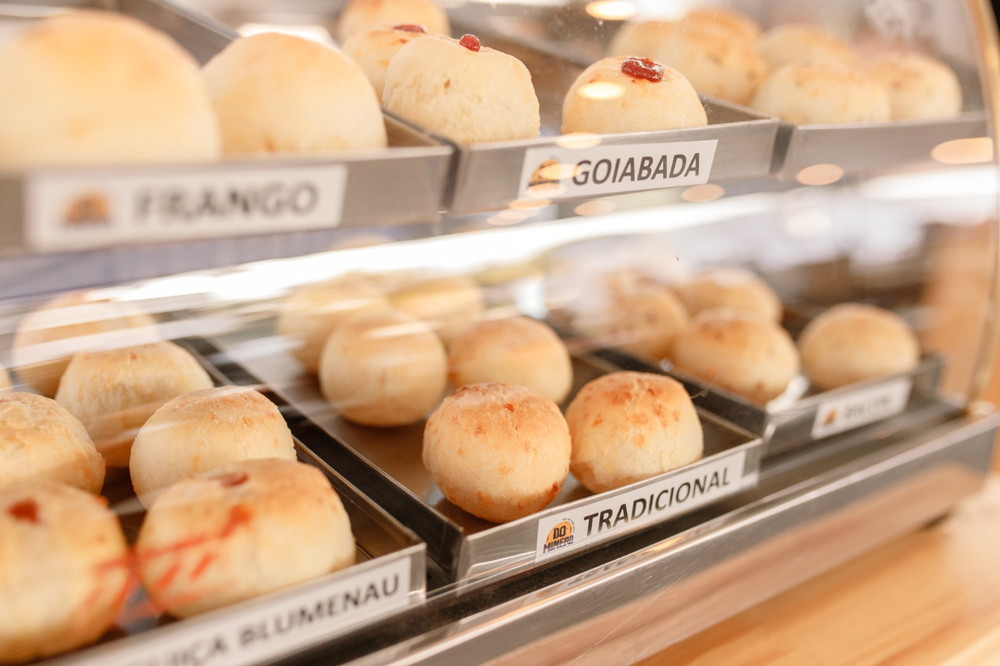

# 🧀 Do Minero — Pão de Queijaria

Site institucional e cardápio digital da **Do Minero Pão de Queijaria**, desenvolvido com HTML, CSS e JavaScript puro.



---

## 🚀 Acesse o projeto

🔗 [Ver site ao vivo](https://luisfelipel-dev.github.io/do-minero-site/) <!-- substitua pelo seu link real -->

---

## 📋 Sobre o projeto

A **Do Minero** é uma pão de queijaria artesanal com sabor mineiro. Este site foi criado para apresentar os produtos da marca, contar a história por trás do negócio e facilitar o contato direto com os clientes via WhatsApp e Instagram.

---

## ✨ Funcionalidades

- 🖼️ **Banner com slideshow automático** — troca de imagens a cada 4 segundos com pausa ao passar o mouse
- 🧀 **Cardápio de produtos** — grid responsivo com cards de cada sabor disponível
- 📖 **Seção Sobre Nós** — história e valores da marca
- 💬 **Botão flutuante do WhatsApp** — contato direto com um clique
- 📸 **Botão flutuante do Instagram** — link para o perfil da marca
- 📱 **Design responsivo** — adaptado para mobile, tablet e desktop

---

## 🛠️ Tecnologias utilizadas

- **HTML5** — estrutura semântica com tags corretas (`header`, `main`, `section`, `article`, `footer`)
- **CSS3** — layout com Grid, Flexbox, media queries e animações
- **JavaScript** — manipulação do DOM, slideshow com autoplay e controle por botões

---

## 📁 Estrutura de arquivos

```
do-minero/
│
├── index.html        # Estrutura principal da página
├── style.css         # Estilos e responsividade
├── script.js         # Lógica do banner/slideshow
│
└── imagens/
    ├── logo minero.png
    ├── banner0.jpg
    ├── banner1.jpg
    ├── banner2.jpg
    ├── banner3.jpg
    ├── pao1.jpeg ~ pao5.jpeg
    ├── whatsapp.png
    └── instagram.png
```

---

## 💡 Boas práticas aplicadas

- ✅ HTML semântico e acessível (`aria-label`, `aria-labelledby`, `alt` em todas as imagens)
- ✅ SEO básico com meta description e Open Graph
- ✅ `loading="lazy"` nas imagens para melhor performance
- ✅ Layout responsivo com CSS Grid e media queries
- ✅ JavaScript sem dependências externas (Vanilla JS)

---

## 📱 Responsividade

| Dispositivo | Colunas no grid |
|-------------|----------------|
| Mobile      | 2 colunas       |
| Tablet      | 3 colunas       |
| Desktop     | 4 colunas       |
| Tela grande | 5 colunas       |

---

## 🔧 Como rodar localmente

1. Clone o repositório:
```bash
git clone https://github.com/Luisfelipel-dev/do-minero-site.git
```

2. Acesse a pasta:
```bash
cd do-minero-site
```

3. Abra o arquivo `index.html` no navegador — sem necessidade de servidor ou dependências!

---

## 📬 Contato da marca

- 📱 WhatsApp: [+55 47 96038703](https://wa.me/5547996038703)
- 📸 Instagram: [@domineropaodequeijaria](https://www.instagram.com/domineropaodequeijaria/)

---

## 👨‍💻 Desenvolvido por

**Luís Felipe Lima**  
Estudante de Desenvolvimento Web — DevClub  
[LinkedIn](https://www.linkedin.com/in/lu%C3%ADs-felipe-lima/) · [GitHub](https://github.com/Luisfelipel-dev)

---

> *"Feito com carinho, do jeitinho minero."* 🧀
